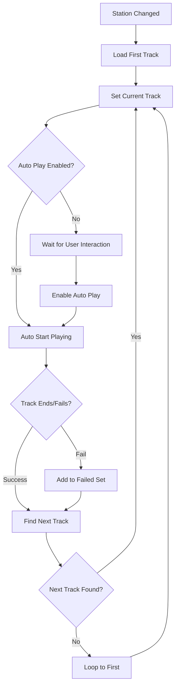

# 🎣 Architecture des Hooks - Onde Spectrale

## 📋 Vue d'ensemble

L'application Onde Spectrale utilise une architecture de hooks React moderne et optimisée pour gérer l'état complexe de l'application radio. Cette architecture garantit des performances élevées et une maintenance facile.

## 🎵 usePlaylistManager Hook

### Responsabilités
- Gestion de la lecture automatique des playlists
- Enchaînement intelligent des pistes
- Gestion des erreurs et des échecs de lecture
- Interface avec l'API audio native

### Interface Publique

```typescript
interface PlaylistManagerReturn {
  // État de lecture
  currentTrack: PlaylistItem | undefined;
  isPlaying: boolean;
  isLoadingTrack: boolean;
  
  // Contrôles de lecture
  togglePlayPause: () => Promise<void>;
  nextTrack: () => void;
  previousTrack: () => void;
  playTrackById: (trackId: string) => Promise<void>;
  
  // Gestion de l'autoplay
  autoPlayEnabled: boolean;
  enableAutoPlay: () => void;
  
  // État de la playlist
  playlistLength: number;
  canGoBack: boolean;
  failedTracks: Set<string>;
  
  // Messages et erreurs
  ttsMessage: string | null;
  errorMessage: string | null;
  ttsEnabled: boolean;
  enableTTS: () => void;
  
  // Référence audio
  audioRef: RefObject<HTMLAudioElement>;
}
```

### États Internes

```typescript
// États principaux de lecture
const [currentTrack, setCurrentTrack] = useState<PlaylistItem | undefined>();
const [playbackState, setPlaybackState] = useState<PlaybackState>('idle');
const [autoPlayEnabled, setAutoPlayEnabled] = useState(false);

// Gestion historique et erreurs
const [playlistHistory, setPlaylistHistory] = useState<string[]>([]);
const [failedTracks, setFailedTracks] = useState<Set<string>>(new Set());

// Messages utilisateur
const [ttsMessage, setTtsMessage] = useState<string | null>(null);
const [errorMessage, setErrorMessage] = useState<string | null>(null);

// Refs pour stabilité
const audioRef = useRef<HTMLAudioElement>(null);
const isMountedRef = useRef(true);
const currentOperationId = useRef<string | null>(null);
```

### Flux de Données Principal



### Optimisations Clés

#### 1. Évitement des Dépendances Circulaires

**❌ Problème :**
```typescript
const nextTrack = useCallback(() => {
  playTrackById(nextTrackId); // Crée une dépendance circulaire
}, [playTrackById]);

const playTrackById = useCallback(async (id) => {
  // ... logic
  if (error) setTimeout(nextTrack, 1500); // Cercle vicieux
}, [nextTrack]);
```

**✅ Solution :**
```typescript
const nextTrack = useCallback(() => {
  setCurrentTrack(nextValidTrack); // Changement d'état simple
  // L'effect autoplay gérera la lecture
}, [findNextValidTrack]);

// L'effect autoplay est déclenché par le changement de currentTrack
useEffect(() => {
  if (autoPlayEnabled && currentTrack && !isPlaying) {
    startPlayingTrack(currentTrack);
  }
}, [autoPlayEnabled, currentTrack]);
```

#### 2. Logique Inline pour Éviter les Références Instables

```typescript
// Au lieu d'utiliser findNextValidTrack dans les dépendances
setTimeout(() => {
  // Logique inline pour trouver la prochaine piste
  const currentIndex = station.playlist.findIndex(t => t.id === trackId);
  let nextTrack = null;
  
  for (let i = 1; i <= station.playlist.length; i++) {
    const nextIndex = (currentIndex + i) % station.playlist.length;
    const track = station.playlist[nextIndex];
    if (!failedTracks.has(track.id) && isValidTrack(track)) {
      nextTrack = track;
      break;
    }
  }
  
  if (nextTrack) setCurrentTrack(nextTrack);
}, 1500);
```

#### 3. Gestion Robuste du Cycle de Vie

```typescript
useEffect(() => {
  isMountedRef.current = true;
  
  return () => {
    isMountedRef.current = false;
    stopPlayback(); // Nettoyage complet
  };
}, []);

// Vérifications avant chaque action
const safeAction = useCallback(() => {
  if (!isMountedRef.current) return;
  // Action sécurisée
}, []);
```

## 📻 useRadioStore Hook (Zustand)

### Store Global pour l'État Radio

```typescript
interface RadioStore {
  // Fréquence et station
  frequency: number;
  sliderValue: number;
  currentStation: Station | null;
  
  // États UI
  isLoadingStation: boolean;
  isScanning: boolean;
  signalStrength: number;
  error: string | null;
  
  // Actions
  setFrequency: (freq: number) => void;
  setCurrentStation: (station: Station | null) => void;
  setError: (error: string | null) => void;
}
```

### Avantages Zustand vs useState

```typescript
// ❌ useState dispersé
const [frequency, setFrequency] = useState(100.7);
const [station, setStation] = useState(null);
const [loading, setLoading] = useState(false);

// ✅ Store centralisé
const { frequency, currentStation, isLoadingStation, setFrequency } = useRadioStore();
```

## 🎛️ useRadioSoundEffects Hook

### Gestion des Effets Sonores

```typescript
interface SoundEffectsConfig {
  volume: number;
  enableEffects: boolean;
  fadeInDuration: number;
  fadeOutDuration: number;
}

export function useRadioSoundEffects(config: SoundEffectsConfig) {
  const [audioContext, setAudioContext] = useState<AudioContext | null>(null);
  
  const playTuning = useCallback(() => {
    if (!config.enableEffects) return;
    // Jouer effet de syntonisation
  }, [config.enableEffects]);
  
  const playStatic = useCallback(() => {
    // Effet de statique radio
  }, []);
  
  return { playTuning, playStatic };
}
```

## ⚡ Patterns d'Optimisation

### 1. Memoization Intelligente

```typescript
// useMemo pour calculs coûteux uniquement
const expensiveCalculation = useMemo(() => {
  return complexCalculation(data);
}, [data]); // Dépendance primitive stable

// useCallback pour fonctions passées en props
const stableCallback = useCallback((param) => {
  // Logic here
}, [dependency]); // Dépendances minimales
```

### 2. Lazy Loading des Hooks

```typescript
// Hook chargé conditionnellement
const playlistManager = useMemo(() => {
  if (!currentStation) return null;
  return usePlaylistManager({ station: currentStation, user, allDjs });
}, [currentStation, user, allDjs]);
```

### 3. Batch d'Updates d'État

```typescript
// ❌ Multiples re-renders
setCurrentTrack(track);
setPlaybackState('loading');
setErrorMessage(null);

// ✅ Batch automatique React 18
React.startTransition(() => {
  setCurrentTrack(track);
  setPlaybackState('loading');
  setErrorMessage(null);
});
```

## 🔧 Debugging et Monitoring

### Logs Structurés dans les Hooks

```typescript
const playTrackById = useCallback(async (trackId: string) => {
  console.log(`🎵 [PlaylistManager] Starting track: ${trackId}`);
  
  try {
    const result = await getAudioForTrack(track);
    console.log(`✅ [PlaylistManager] Track loaded successfully: ${track.title}`);
  } catch (error) {
    console.error(`❌ [PlaylistManager] Track failed: ${trackId}`, error);
  }
}, []);
```

### Hook Performance Monitoring

```typescript
const usePerformanceTracker = (hookName: string) => {
  useEffect(() => {
    const start = performance.now();
    return () => {
      const duration = performance.now() - start;
      console.log(`⏱️ [${hookName}] Render duration: ${duration.toFixed(2)}ms`);
    };
  });
};

// Usage dans les hooks critiques
export function usePlaylistManager(props) {
  usePerformanceTracker('PlaylistManager');
  // ... hook logic
}
```

## 📊 Tests et Validation

### Test Pattern pour Hooks

```typescript
import { renderHook, act } from '@testing-library/react';
import { usePlaylistManager } from './usePlaylistManager';

describe('usePlaylistManager', () => {
  it('should auto-advance to next track', async () => {
    const { result } = renderHook(() => usePlaylistManager({
      station: mockStation,
      user: mockUser,
      allDjs: mockDjs
    }));
    
    act(() => {
      result.current.enableAutoPlay();
    });
    
    // Simuler fin de piste
    act(() => {
      result.current.nextTrack();
    });
    
    expect(result.current.currentTrack).toEqual(expectedNextTrack);
  });
});
```

Cette architecture de hooks garantit une séparation claire des responsabilités, des performances optimales, et une maintenance facile du code complexe de l'application radio.