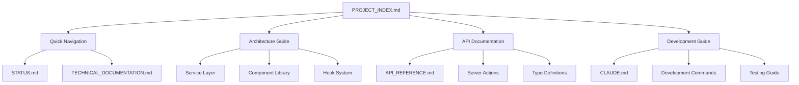
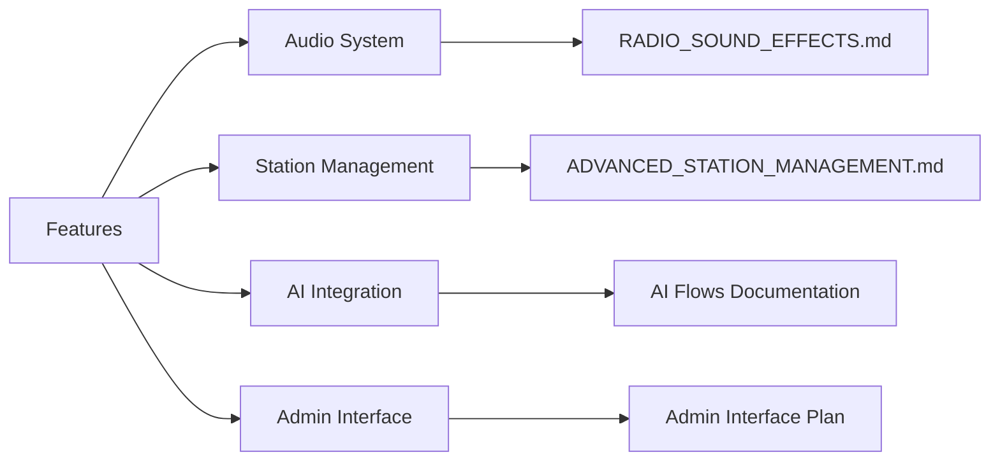

# 🧭 Documentation Navigation

> Complete guide to navigating Onde Spectrale documentation

## 📚 Documentation Structure

```
docs/
├── README.md                 # 📖 Documentation hub and quick start guide
├── PROJECT_INDEX.md          # 📋 Complete project overview and navigation
├── API_REFERENCE.md          # 📡 Complete API documentation  
├── NAVIGATION.md             # 🧭 This file - documentation structure
├── STATUS.md                 # 📊 Current project status
├── TECHNICAL_DOCUMENTATION.md # 🏗️ Technical architecture details
├── HOOKS_ARCHITECTURE.md     # ⚡ React hooks system documentation
├── DEPLOYMENT.md             # 🚀 Deployment instructions
├── TROUBLESHOOTING.md        # 🔧 Common issues and solutions
├── DEVELOPMENT_WORKFLOW.md   # 💻 Development process and standards
├── GIT_WORKFLOW.md           # 🌿 Git branching and conventions
├── ADMIN_INTERFACE_PLAN.md   # 🎛️ Admin interface requirements
└── blueprint.md              # 📐 Original project blueprint
```

## 🎯 Quick Access Guide

### 👋 New to the Project?
**Start Here:**
1. [README.md](./README.md) - Documentation hub and quick start
2. [PROJECT_INDEX.md](./PROJECT_INDEX.md) - Complete project overview
3. [STATUS.md](./STATUS.md) - Current project status
4. [TECHNICAL_DOCUMENTATION.md](./TECHNICAL_DOCUMENTATION.md) - Architecture deep dive

### 💻 Developers
**Development Resources:**
1. [API_REFERENCE.md](./API_REFERENCE.md) - Complete API documentation
2. [CLAUDE.md](../CLAUDE.md) - Claude Code development guide
3. [TECHNICAL_DOCUMENTATION.md](./TECHNICAL_DOCUMENTATION.md) - Architecture guide

### 🚀 Deployment & Operations
**Deployment Resources:**
1. [DEPLOYMENT.md](./DEPLOYMENT.md) - Deployment instructions
2. [TROUBLESHOOTING.md](./TROUBLESHOOTING.md) - Common issues
3. Root level deployment files:
   - [DEPLOY.md](../DEPLOY.md)
   - [FIREBASE_QUICKSTART.md](../FIREBASE_QUICKSTART.md)

### 🎵 Features & Components
**Feature Documentation:**
1. [RADIO_SOUND_EFFECTS.md](../RADIO_SOUND_EFFECTS.md) - Audio system
2. [ADVANCED_STATION_MANAGEMENT.md](../ADVANCED_STATION_MANAGEMENT.md) - Station features
3. [PLAYLIST_IMPROVEMENTS.md](../PLAYLIST_IMPROVEMENTS.md) - Playlist system

## 🗺️ Documentation Map

### Core Documentation Hierarchy



### Feature-Specific Documentation



## 🔍 Finding Specific Information

### By Role

#### **Frontend Developer**
```
📋 Start: PROJECT_INDEX.md → Component Library
📡 API: API_REFERENCE.md → React Components
🎨 UI: TECHNICAL_DOCUMENTATION.md → Component Architecture
🧪 Testing: PROJECT_INDEX.md → Testing Guide
```

#### **Backend Developer**
```
📋 Start: PROJECT_INDEX.md → Service Layer
📡 API: API_REFERENCE.md → Server Actions
🏗️ Architecture: TECHNICAL_DOCUMENTATION.md → Service Architecture
🔧 Setup: CLAUDE.md → Development Commands
```

#### **DevOps Engineer**
```
🚀 Deploy: DEPLOYMENT.md
🔧 Issues: TROUBLESHOOTING.md
📊 Status: STATUS.md
🔥 Firebase: FIREBASE_QUICKSTART.md
```

#### **Project Manager**
```
📊 Status: STATUS.md
📋 Overview: PROJECT_INDEX.md
📈 Progress: PROGRESS_SUMMARY.md
🎯 Features: ADVANCED_STATION_MANAGEMENT.md
```

### By Task

#### **Setting Up Development**
1. [CLAUDE.md](../CLAUDE.md) → Development Setup
2. [PROJECT_INDEX.md](./PROJECT_INDEX.md) → Development Guide
3. [FIREBASE_QUICKSTART.md](../FIREBASE_QUICKSTART.md) → Firebase Setup

#### **Understanding Architecture**
1. [PROJECT_INDEX.md](./PROJECT_INDEX.md) → Architecture Guide
2. [TECHNICAL_DOCUMENTATION.md](./TECHNICAL_DOCUMENTATION.md) → Detailed Architecture
3. [API_REFERENCE.md](./API_REFERENCE.md) → Service Layer APIs

#### **Working with APIs**
1. [API_REFERENCE.md](./API_REFERENCE.md) → Complete API Reference
2. [PROJECT_INDEX.md](./PROJECT_INDEX.md) → API Documentation Section
3. Source code examples in `src/app/actions.ts`

#### **Debugging Issues**
1. [TROUBLESHOOTING.md](./TROUBLESHOOTING.md) → Common Issues
2. [TEST_ANALYSIS.md](../TEST_ANALYSIS.md) → Test Issues
3. [PLAYLIST_TROUBLESHOOTING.md](../PLAYLIST_TROUBLESHOOTING.md) → Playlist Issues

#### **Deploying to Production**
1. [DEPLOYMENT.md](./DEPLOYMENT.md) → Deployment Guide
2. [DEPLOY.md](../DEPLOY.md) → Quick Deploy
3. [FIREBASE_STATUS.md](../FIREBASE_STATUS.md) → Firebase Status

### By Component/Feature

#### **Radio Interface**
- **Components**: `OndeSpectraleRadio`, `AudioPlayer`, `SpectrumAnalyzer`
- **Documentation**: [TECHNICAL_DOCUMENTATION.md](./TECHNICAL_DOCUMENTATION.md) → Radio Interface
- **Sound Effects**: [RADIO_SOUND_EFFECTS.md](../RADIO_SOUND_EFFECTS.md)

#### **Station Management**
- **Components**: `RadioStationManager`, `StationEditor`
- **Documentation**: [ADVANCED_STATION_MANAGEMENT.md](../ADVANCED_STATION_MANAGEMENT.md)
- **API**: [API_REFERENCE.md](./API_REFERENCE.md) → Station Management

#### **Playlist System**
- **Components**: `EnhancedPlaylistInterface`, `PlaylistManager`
- **Documentation**: [PLAYLIST_IMPROVEMENTS.md](../PLAYLIST_IMPROVEMENTS.md)
- **Service**: `PlaylistManagerService` in [API_REFERENCE.md](./API_REFERENCE.md)

#### **Admin Interface**
- **Components**: `AdminAnalytics`, `RealTimePlayerMonitor`
- **Documentation**: [docs/ADMIN_INTERFACE_PLAN.md](./ADMIN_INTERFACE_PLAN.md)
- **Layout**: `src/app/admin/layout.tsx`

#### **AI Integration**
- **Flows**: `src/ai/flows/`
- **Documentation**: [API_REFERENCE.md](./API_REFERENCE.md) → AI Content Generation
- **Services**: `generateDjAudio`, `generatePlaylist`

## 🔗 Cross-References

### Related Files by Topic

#### **Development Setup**
```
CLAUDE.md ↔ PROJECT_INDEX.md (Development Guide)
FIREBASE_QUICKSTART.md ↔ DEPLOYMENT.md
package.json ↔ PROJECT_INDEX.md (Commands)
```

#### **API Documentation**
```
API_REFERENCE.md ↔ src/app/actions.ts
PROJECT_INDEX.md ↔ API_REFERENCE.md
TECHNICAL_DOCUMENTATION.md ↔ API_REFERENCE.md (Service Layer)
```

#### **Architecture**
```
TECHNICAL_DOCUMENTATION.md ↔ PROJECT_INDEX.md
ARCHITECTURE_GUIDE.md ↔ TECHNICAL_DOCUMENTATION.md
blueprint.md ↔ PROJECT_INDEX.md (Original Design)
```

#### **Testing**
```
TEST_ANALYSIS.md ↔ PROJECT_INDEX.md (Testing Guide)
TEST_PLAN.md ↔ API_REFERENCE.md
src/services/__tests__/ ↔ API_REFERENCE.md (Service APIs)
```

### File Dependencies

#### **Core Dependencies**
- `PROJECT_INDEX.md` → References all other documentation
- `API_REFERENCE.md` → Referenced by technical guides
- `STATUS.md` → Referenced by project overview
- `CLAUDE.md` → Referenced by development guides

#### **Feature Dependencies**
- Station features → `ADVANCED_STATION_MANAGEMENT.md`
- Audio features → `RADIO_SOUND_EFFECTS.md`
- Playlist features → `PLAYLIST_IMPROVEMENTS.md`
- Admin features → `docs/ADMIN_INTERFACE_PLAN.md`

## 📱 Documentation Formats

### Markdown Files (.md)

#### **Primary Documentation**
- Comprehensive guides and references
- Cross-platform compatibility
- Version control friendly
- GitHub integration

#### **Quick Reference**
- Checklists and summaries
- Command references
- Troubleshooting guides

### Code Documentation

#### **TypeScript Interfaces**
- `src/lib/types.ts` - Core type definitions
- Service interfaces - In service files
- Component props - In component files

#### **JSDoc Comments**
- Function documentation
- Parameter descriptions
- Usage examples

#### **README Files**
- Package-specific documentation
- Setup instructions
- Usage examples

### Interactive Documentation

#### **Storybook Components**
- Component library showcase
- Interactive examples
- Visual documentation

#### **Test Files**
- Usage examples
- API contracts
- Behavior documentation

## 🎯 Documentation Standards

### File Naming Conventions

#### **Core Documentation**
- `UPPERCASE.md` for main documentation files
- `lowercase.md` for supplementary files
- Descriptive names reflecting content

#### **Feature Documentation**
- `FEATURE_NAME.md` for feature-specific docs
- `COMPONENT_NAME.md` for component docs
- `SERVICE_NAME.md` for service docs

### Content Structure

#### **Standard Sections**
1. **Title & Description** - Clear purpose statement
2. **Table of Contents** - Easy navigation
3. **Quick Start** - Essential information first
4. **Detailed Information** - Comprehensive coverage
5. **Examples** - Practical usage demonstrations
6. **References** - Links to related content

#### **Cross-Reference Format**
- Internal links: `[Title](./relative-path.md)`
- External links: `[Title](https://external-url)`
- Code references: `src/path/to/file.ts:123`
- Component references: `` `ComponentName` ``

### Maintenance Guidelines

#### **Regular Updates**
- Update version numbers and dates
- Verify all links work correctly
- Update examples with current API
- Review and update screenshots

#### **Quality Checks**
- Spell check and grammar review
- Link validation
- Code example testing
- Cross-reference verification

## 🔄 Update Cycle

### Documentation Versioning

#### **Major Updates (v1.0, v2.0)**
- Complete documentation review
- Architecture documentation updates
- API reference comprehensive review
- All examples updated and tested

#### **Minor Updates (v1.1, v1.2)**
- New feature documentation
- API additions and changes
- Updated examples
- Cross-reference updates

#### **Patch Updates (v1.1.1, v1.1.2)**
- Bug fix documentation
- Clarifications and corrections
- Link fixes
- Minor improvements

### Update Responsibilities

#### **Developers**
- Update API documentation for changes
- Add examples for new features
- Update technical architecture docs
- Maintain code documentation

#### **Project Maintainers**
- Review all documentation changes
- Ensure consistency across files
- Maintain navigation structure
- Update project status

---

## 📞 Documentation Feedback

### Reporting Issues
- Use GitHub issues for documentation problems
- Label with `documentation` tag
- Provide specific file and section references
- Suggest improvements when possible

### Contributing Improvements
- Follow existing documentation standards
- Test all code examples
- Verify cross-references
- Update related files consistently

---

*Navigation guide last updated: 2025-01-01*  
*Compatible with Onde Spectrale v0.9.5+*