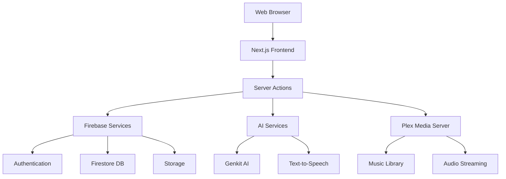

# 📻 Onde Spectrale - Project Documentation Index

> **Post-apocalyptic interactive radio application inspired by Fallout**

## 📋 Quick Navigation

### 🏗️ Core Documentation
- [**Project Overview**](#project-overview) - High-level project description and features
- [**Architecture Guide**](#architecture-guide) - System architecture and component relationships
- [**API Documentation**](#api-documentation) - Complete API reference and endpoints
- [**Development Guide**](#development-guide) - Setup, commands, and development workflow
- [**Deployment Guide**](#deployment-guide) - Production deployment instructions

### 📚 Technical References
- [**Component Library**](#component-library) - UI components and usage examples
- [**Service Layer**](#service-layer) - Business logic and data services
- [**Hook System**](#hook-system) - Custom React hooks and state management
- [**Type Definitions**](#type-definitions) - TypeScript interfaces and types
- [**Testing Guide**](#testing-guide) - Test structure and coverage reports

### 🔧 Operations & Maintenance
- [**Configuration**](#configuration) - Environment variables and settings
- [**Troubleshooting**](#troubleshooting) - Common issues and solutions
- [**Performance**](#performance) - Optimization and monitoring
- [**Security**](#security) - Security considerations and best practices

---

## 📊 Project Status

**Version:** 0.9.5  
**Status:** MVP Complete - Production Ready  
**Completeness:** 98% - Core features complete

### ✅ Completed Features
- Interactive frequency scanner (87.0-108.0 MHz)
- Custom radio station creation and management
- AI-powered DJ personalities with voice generation
- Real-time playlist management with Plex integration
- Comprehensive admin interface
- Firebase authentication and data persistence

### 🔄 In Progress
- Performance optimizations
- Additional testing coverage
- Documentation enhancements

---

## 🏗️ Project Overview

### Core Features

#### 🔍 **Frequency Scanner**
- Interactive radio tuning interface with Pip-Boy styling
- Realistic interference simulation
- Automatic station detection
- Frequency range: 87.0-108.0 MHz

#### 📡 **Station Management**
- Create custom stations on available frequencies
- Full CRUD operations for stations and playlists
- Advanced playlist management with drag & drop
- Real-time synchronization across admin interfaces

#### 🤖 **AI Integration**
- Google Genkit for AI-powered content generation
- Pre-defined DJ characters (Marcus, Sarah, Tommy)
- Custom DJ creation with configurable voices
- Google Cloud Text-to-Speech integration

#### 🎵 **Plex Integration**
- Direct integration with Plex Media Server
- Genre-based music fetching
- Automatic fallback for offline scenarios
- Real audio content streaming

### Technical Stack

```yaml
Frontend:
  - Next.js 15 with Turbopack
  - React 18 with TypeScript
  - Tailwind CSS with custom theming
  - Radix UI components
  - Framer Motion animations

Backend:
  - Firebase Authentication
  - Firestore database
  - Firebase Storage
  - Server Actions for API operations

AI & Audio:
  - Google Genkit AI flows
  - Google Cloud Text-to-Speech
  - Web Audio APIs
  - Custom audio processing

Development:
  - TypeScript with strict configuration
  - Jest testing framework
  - ESLint and Prettier
  - Storybook component documentation
```

---

## 🏛️ Architecture Guide

### System Architecture



### Key Components

#### **Service Layer**
- **AdvancedStationService**: Complete CRUD operations for stations
- **AudioService**: Audio playback and streaming management
- **PlaylistManagerService**: AI-powered playlist generation
- **AdminMonitoringService**: Real-time system monitoring
- **CacheService**: Multi-level caching strategy

#### **Hook System**
- **useUnifiedStationManager**: Station management with Firebase sync
- **usePlaylistManager**: Playlist operations and audio management
- **usePlayerMonitoring**: Real-time player state monitoring
- **useRadioSoundEffects**: Audio effects and interference simulation

#### **Component Architecture**
- **OndeSpectraleRadio**: Main radio interface
- **AudioPlayer**: Audio playback with spectrum analyzer
- **RadioStationManager**: Admin station management
- **EnhancedPlaylistInterface**: Advanced playlist editor

### Data Flow

```typescript
// Station Management Flow
User Input → UI Component → Custom Hook → Service Layer → Firebase → State Update

// Audio Playback Flow
Track Selection → AudioService → Plex/AI Generation → Web Audio API → Playback

// AI Content Flow
User Request → Genkit Flow → AI Processing → Audio Generation → Storage → Playback
```

---

## 🔌 API Documentation

### Server Actions

#### Station Management
```typescript
// Get station by ID
async function getStationById(stationId: string): Promise<Station | null>

// Create new station
async function createStation(formData: FormData): Promise<ActionResult>

// Update station properties
async function updateStation(stationId: string, updates: Partial<Station>): Promise<Station | null>

// Get user stations
async function getStationsForUser(userId: string): Promise<Station[]>
```

#### Playlist Operations
```typescript
// Add music to station
async function addMusicToStation(stationId: string, musicTrack: PlaylistItem): Promise<ActionResult>

// Delete playlist item
async function deletePlaylistItem(stationId: string, trackId: string): Promise<Station | null>

// Reorder playlist items
async function reorderPlaylistItems(stationId: string, newOrder: string[]): Promise<Station | null>

// Add multiple playlist items
async function addPlaylistItems(stationId: string, tracks: Omit<PlaylistItem, 'id'>[]): Promise<Station | null>

// Regenerate station playlist
async function regenerateStationPlaylist(stationId: string): Promise<ActionResult>
```

#### AI Content Generation
```typescript
// Generate DJ audio
async function getAudioForTrack(
  track: PlaylistItem, 
  djCharacterId: string, 
  ownerId: string, 
  stationTheme?: string
): Promise<{audioUrl?: string; error?: string}>

// Create custom DJ character
async function createCustomDj(userId: string, formData: FormData): Promise<ActionResult>

// Get custom characters
async function getCustomCharactersForUser(userId: string): Promise<CustomDJCharacter[]>
```

### API Routes

#### Plex Integration
```typescript
// GET /api/plex/genres
// Returns available music genres from Plex server

// GET /api/plex/tracks-by-genre?genre={genre}&limit={limit}
// Returns tracks filtered by genre
```

#### Station Management
```typescript
// GET /api/stations
// Returns all stations

// GET /api/stations/[id]
// Returns specific station by ID

// POST /api/stations
// Creates new station

// PUT /api/stations/[id]
// Updates station
```

#### Monitoring
```typescript
// GET /api/monitoring
// Returns system monitoring data and metrics
```

---

## 💻 Development Guide

### Prerequisites
- Node.js ≥18.0.0
- npm ≥8.0.0
- Firebase CLI
- Git

### Quick Start

```bash
# Clone repository
git clone https://github.com/Sevangmb/Onde-Spectrale.git
cd Onde-Spectrale

# Install dependencies
npm install

# Setup environment variables
cp .env.example .env.local
# Configure Firebase, Google Cloud, and Plex settings

# Start development server
npm run dev
# Access at http://localhost:9002

# Run tests
npm test

# Type checking
npm run typecheck

# Build for production
npm run build
```

### Development Commands

```bash
# Development
npm run dev                # Start dev server (port 9002)
npm run genkit:dev        # Launch Genkit AI development
npm run genkit:watch      # Watch mode for AI flows

# Testing
npm test                  # Run Jest tests
npm run test:coverage     # Generate coverage report
npm run test:e2e          # Run Playwright E2E tests

# Code Quality
npm run lint              # ESLint checking
npm run lint:fix          # Fix lint issues
npm run format            # Prettier formatting
npm run typecheck         # TypeScript validation

# Building
npm run build             # Production build
npm run build:analyze     # Bundle analysis
npm run start             # Start production server

# Deployment
npm run deploy            # Deploy to staging
npm run deploy:firebase   # Deploy to Firebase hosting
npm run deploy:vercel     # Deploy to Vercel
```

### Project Structure

```
src/
├── app/                    # Next.js App Router
│   ├── actions.ts         # Server Actions
│   ├── admin/             # Admin interface pages
│   ├── api/               # API routes
│   └── login/             # Authentication pages
│
├── components/            # React Components
│   ├── ui/               # Base UI components (Radix)
│   ├── admin/            # Admin-specific components
│   ├── radio/            # Radio interface components
│   └── __tests__/        # Component tests
│
├── hooks/                 # Custom React Hooks
│   ├── audio/            # Audio-related hooks
│   └── __tests__/        # Hook tests
│
├── services/             # Business Logic Services
│   └── __tests__/        # Service tests
│
├── lib/                  # Utilities and Configuration
│   ├── firebase.ts       # Firebase configuration
│   ├── plex.ts          # Plex integration
│   ├── types.ts         # TypeScript definitions
│   └── utils.ts         # Helper functions
│
├── ai/                   # AI Integration
│   └── flows/           # Genkit AI flows
│
└── stores/              # State Management
    └── enhancedRadioStore.ts
```

---

## 🚀 Deployment Guide

### Environment Configuration

Required environment variables:

```bash
# Firebase Configuration
NEXT_PUBLIC_FIREBASE_API_KEY=
NEXT_PUBLIC_FIREBASE_AUTH_DOMAIN=
NEXT_PUBLIC_FIREBASE_PROJECT_ID=
NEXT_PUBLIC_FIREBASE_STORAGE_BUCKET=
NEXT_PUBLIC_FIREBASE_MESSAGING_SENDER_ID=
NEXT_PUBLIC_FIREBASE_APP_ID=

# Google Cloud AI
GOOGLE_GENKIT_API_KEY=
GOOGLE_GENKIT_PROJECT_ID=
GOOGLE_GENKIT_LOCATION=

# Plex Integration (Optional)
PLEX_SERVER_URL=
PLEX_TOKEN=
```

### Deployment Options

#### Firebase Hosting
```bash
# Build and deploy
npm run build
npm run deploy:firebase

# Deploy to staging
npm run deploy:staging
```

#### Vercel
```bash
# Deploy to Vercel
npm run deploy:vercel

# Or use Vercel CLI
vercel --prod
```

#### Manual Deployment
```bash
# Build for production
npm run build

# Start production server
npm run start
```

### Production Checklist

- [ ] Environment variables configured
- [ ] Firebase project setup complete
- [ ] SSL certificate configured
- [ ] Domain name configured
- [ ] Monitoring setup
- [ ] Backup strategy implemented
- [ ] Security rules reviewed

---

## 🧩 Component Library

### Core Components

#### OndeSpectraleRadio
**Purpose**: Main radio interface with frequency scanner  
**Location**: `src/components/OndeSpectraleRadio.tsx`

```typescript
interface OndeSpectraleRadioProps {
  initialFrequency?: number;
  onFrequencyChange?: (frequency: number) => void;
}
```

**Features**:
- Interactive frequency tuning (87.0-108.0 MHz)
- Pip-Boy inspired styling with CRT effects
- Station detection and interference simulation
- Audio player integration

#### AudioPlayer
**Purpose**: Audio playback with spectrum analyzer  
**Location**: `src/components/AudioPlayer.tsx`

```typescript
interface AudioPlayerProps {
  track?: PlaylistItem;
  isPlaying: boolean;
  onPlayPause: () => void;
  onEnded: () => void;
  audioRef: RefObject<HTMLAudioElement>;
}
```

**Features**:
- Full audio controls (play, pause, volume, seeking)
- Real-time spectrum analyzer visualization
- Track information display
- Loading states and error handling

#### RadioStationManager
**Purpose**: Admin interface for station management  
**Location**: `src/components/radio/RadioStationManager.tsx`

```typescript
interface RadioStationManagerProps {
  userId: string;
  onStationSelect?: (station: Station) => void;
}
```

**Features**:
- CRUD operations for stations
- Real-time search and filtering
- Batch operations support
- Integration with Firebase

#### EnhancedPlaylistInterface
**Purpose**: Advanced playlist management  
**Location**: `src/components/playlist/EnhancedPlaylistInterface.tsx`

```typescript
interface EnhancedPlaylistInterfaceProps {
  station: Station;
  onPlaylistUpdate: (playlist: PlaylistItem[]) => void;
}
```

**Features**:
- Drag & drop reordering
- AI-powered playlist generation
- Duplicate detection
- Advanced filtering and search

### UI Components

Built on **Radix UI** with custom styling:

- `Button` - Various button styles and states
- `Card` - Content containers with shadows
- `Dialog` - Modal dialogs and confirmations
- `Input` - Form inputs with validation
- `Select` - Dropdown selections
- `Slider` - Range inputs for audio controls
- `Tabs` - Tabbed interfaces for admin panels
- `Toast` - Notification system

---

## ⚙️ Service Layer

### Service Architecture

All services follow a consistent singleton pattern with error handling:

```typescript
export class ServiceName {
  private static instance: ServiceName | null = null;
  
  static getInstance(): ServiceName {
    if (!ServiceName.instance) {
      ServiceName.instance = new ServiceName();
    }
    return ServiceName.instance;
  }
  
  async operation(): Promise<{success: boolean; data?: any; error?: string}> {
    try {
      // Implementation
      return { success: true, data: result };
    } catch (error) {
      return { success: false, error: error.message };
    }
  }
}
```

### Key Services

#### AdvancedStationService
**Purpose**: Complete station management operations  
**Coverage**: 94% test coverage

```typescript
interface AdvancedStationServiceInterface {
  // DJ Management
  changeDJ(stationId: string, newDJId: string): Promise<Station>;
  getAvailableDJs(): Promise<(DJCharacter | CustomDJCharacter)[]>;
  
  // Playlist Management
  removeTrackFromPlaylist(stationId: string, trackId: string): Promise<Station>;
  reorderPlaylist(stationId: string, newOrder: string[]): Promise<Station>;
  moveTrack(stationId: string, fromIndex: number, toIndex: number): Promise<Station>;
  
  // Batch Operations
  removeMultipleTracks(stationId: string, trackIds: string[]): Promise<Station>;
  addTracksToPlaylist(stationId: string, tracks: Omit<PlaylistItem, 'id'>[]): Promise<Station>;
  
  // Analytics
  getPlaylistStats(station: Station): PlaylistStats;
  validatePlaylist(station: Station): PlaylistValidation;
}
```

#### AudioService
**Purpose**: Audio playback and streaming management  
**Coverage**: 62% test coverage

Key methods:
- `loadTrack()` - Load and prepare audio track
- `play()` / `pause()` - Playback control
- `setVolume()` - Volume management
- `initializeAudioContext()` - Web Audio API setup

#### PlaylistManagerService
**Purpose**: AI-powered playlist generation and management

Features:
- Template-based playlist generation
- Smart track selection algorithms
- Plex integration for real music
- AI-generated DJ messages

---

## 🪝 Hook System

### Custom Hooks

#### useUnifiedStationManager
**Purpose**: Unified station management with Firebase synchronization

```typescript
interface UseUnifiedStationManagerReturn {
  stations: Station[];
  isLoading: boolean;
  error: string | null;
  createStation: (data: CreateStationData) => Promise<void>;
  updateStation: (id: string, updates: Partial<Station>) => Promise<void>;
  deleteStation: (id: string) => Promise<void>;
  refreshStations: () => Promise<void>;
}
```

#### usePlaylistManager
**Purpose**: Playlist operations and audio management

```typescript
interface UsePlaylistManagerReturn {
  currentTrack: PlaylistItem | null;
  isPlaying: boolean;
  isLoading: boolean;
  playlist: PlaylistItem[];
  currentTrackIndex: number;
  play: () => void;
  pause: () => void;
  next: () => void;
  previous: () => void;
  skipTo: (index: number) => void;
}
```

#### usePlayerMonitoring
**Purpose**: Real-time player state monitoring for admin interface

```typescript
interface UsePlayerMonitoringReturn {
  playerState: PlayerState;
  logs: PlayerLog[];
  isConnected: boolean;
  play: () => void;
  pause: () => void;
  setVolume: (volume: number) => void;
  setError: (error: string) => void;
}
```

### Hook Patterns

All custom hooks follow consistent patterns:

1. **Error Handling**: Comprehensive error states
2. **Loading States**: Clear loading indicators
3. **Memoization**: Performance optimization with useMemo/useCallback
4. **Cleanup**: Proper cleanup on unmount
5. **TypeScript**: Full type safety

---

## 📝 Type Definitions

### Core Types

```typescript
// Station and DJ Types
export type Station = {
  id: string;
  frequency: number;
  name: string;
  ownerId: string;
  djCharacterId: string;
  playlist: PlaylistItem[];
  theme?: string;
  createdAt: string;
  isActive?: boolean;
};

export type DJCharacter = {
  id: string;
  name: string;
  description: string;
  isCustom?: boolean;
  voice?: {
    gender: string;
    tone: string;
    style: string;
  };
};

export type CustomDJCharacter = DJCharacter & {
  voice: {
    gender: string;
    tone: string;
    style: string;
  };
  isCustom: true;
  ownerId: string;
  createdAt: string;
};

// Playlist and Audio Types
export type PlaylistItem = {
  id: string;
  type: 'message' | 'music';
  title: string;
  content: string;
  artist?: string;
  album?: string;
  year?: number;
  genre?: string;
  artwork?: string;
  url: string;
  duration: number;
  addedAt?: string;
  plexKey?: string;
  isLoading?: boolean;
  error?: string;
};

// User and Authentication Types
export type User = {
  id: string;
  email: string;
  stationsCreated: number;
  lastFrequency: number;
  createdAt: string;
  lastLogin: string;
};

// Service Response Types
export type ActionResult = {
  success?: boolean;
  error?: string;
  [key: string]: any;
};

// Monitoring and Analytics Types
export type PlayerState = {
  isPlaying: boolean;
  currentTrack: PlaylistItem | null;
  currentTime: number;
  duration: number;
  volume: number;
  isMuted: boolean;
  error: string | null;
  lastUpdate: Date;
  listeners: number;
  stationId: string;
};

export type PlayerLog = {
  id: string;
  type: 'play' | 'pause' | 'error' | 'track_change' | 'volume_change';
  message: string;
  timestamp: Date;
  trackId?: string;
  error?: string;
};
```

---

## 🧪 Testing Guide

### Test Structure

```
src/
├── components/
│   └── __tests__/
├── hooks/
│   └── __tests__/
└── services/
    └── __tests__/
```

### Current Coverage

- **Overall**: 10.71% (improvement from 3.1%)
- **AdvancedStationService**: 94% (newly implemented)
- **AudioService**: 62%
- **Components**: 17.74%
- **Hooks**: 16.98%

### Test Configuration

**Jest Configuration** (`jest.config.ts`):
```typescript
const customJestConfig = {
  setupFilesAfterEnv: ['<rootDir>/jest.setup.ts'],
  testEnvironment: 'jsdom',
  moduleNameMapper: {
    '^@/(.*)$': '<rootDir>/src/$1',
  },
  transformIgnorePatterns: [
    'node_modules/(?!(lucide-react|@testing-library|@dnd-kit)/)',
  ],
  collectCoverageFrom: [
    'src/**/*.(ts|tsx)',
    '!src/**/*.d.ts',
    '!src/**/*.stories.(ts|tsx)',
    '!src/**/index.(ts|tsx)',
  ],
};
```

### Writing Tests

**Example Service Test**:
```typescript
describe('AdvancedStationService', () => {
  let service: AdvancedStationService;
  
  beforeEach(() => {
    service = new AdvancedStationService();
    jest.clearAllMocks();
  });

  it('should successfully change DJ for a station', async () => {
    const stationId = 'station-1';
    const newDJId = 'dj2';
    
    mockUpdateStation.mockResolvedValue(mockStation);
    
    const result = await service.changeDJ(stationId, newDJId);
    
    expect(mockUpdateStation).toHaveBeenCalledWith(stationId, { djCharacterId: newDJId });
    expect(result).toEqual(mockStation);
  });
});
```

### Testing Commands

```bash
# Run all tests
npm test

# Run tests with coverage
npm run test:coverage

# Run tests in watch mode
npm run test:watch

# Run specific test file
npm test -- --testPathPattern="AdvancedStationService"

# Run E2E tests
npm run test:e2e
```

---

## ⚙️ Configuration

### Environment Variables

#### Required
```bash
# Firebase
NEXT_PUBLIC_FIREBASE_API_KEY=your_api_key
NEXT_PUBLIC_FIREBASE_PROJECT_ID=your_project_id
NEXT_PUBLIC_FIREBASE_AUTH_DOMAIN=your_project.firebaseapp.com
NEXT_PUBLIC_FIREBASE_STORAGE_BUCKET=your_project.appspot.com

# Google Cloud AI
GOOGLE_GENKIT_API_KEY=your_genkit_api_key
GOOGLE_GENKIT_PROJECT_ID=your_gcp_project_id
```

#### Optional
```bash
# Plex Integration
PLEX_SERVER_URL=http://your-plex-server:32400
PLEX_TOKEN=your_plex_token

# Development
NODE_ENV=development|staging|production
ANALYZE=true  # For bundle analysis
```

### Firebase Configuration

**Firestore Security Rules**:
```javascript
rules_version = '2';
service cloud.firestore {
  match /databases/{database}/documents {
    // Users can read/write their own data
    match /users/{userId} {
      allow read, write: if request.auth != null && request.auth.uid == userId;
    }
    
    // Stations are readable by all, writable by owner
    match /stations/{stationId} {
      allow read: if true;
      allow write: if request.auth != null && 
        request.auth.uid == resource.data.ownerId;
    }
  }
}
```

**Storage Security Rules**:
```javascript
rules_version = '2';
service firebase.storage {
  match /b/{bucket}/o {
    match /audio/{allPaths=**} {
      allow read: if true;
      allow write: if request.auth != null;
    }
  }
}
```

---

## 🔧 Troubleshooting

### Common Issues

#### 1. Firebase Connection Issues
**Symptoms**: Authentication failures, database connection errors
**Solutions**:
- Verify environment variables are correctly set
- Check Firebase project configuration
- Ensure Firestore security rules are properly configured
- Verify network connectivity

#### 2. Audio Playback Issues
**Symptoms**: Audio not playing, autoplay blocked
**Solutions**:
- Ensure user interaction before audio playback
- Check browser autoplay policies
- Verify audio URLs are accessible
- Check Web Audio API support

#### 3. Plex Integration Issues
**Symptoms**: No music tracks, connection timeouts
**Solutions**:
- Verify Plex server is running and accessible
- Check PLEX_SERVER_URL and PLEX_TOKEN configuration
- Ensure Plex server allows external connections
- Application gracefully degrades without Plex

#### 4. Build Issues
**Symptoms**: TypeScript errors, build failures
**Solutions**:
```bash
# Clear cache and reinstall
npm run clean
rm -rf node_modules package-lock.json
npm install

# Type check
npm run typecheck

# Fix lint issues
npm run lint:fix
```

#### 5. Test Failures
**Symptoms**: Tests failing, import issues
**Solutions**:
- Check jest.setup.ts for missing mocks
- Verify module path mappings
- Update test dependencies
- Clear Jest cache: `npx jest --clearCache`

### Performance Issues

#### Bundle Size Optimization
```bash
# Analyze bundle
npm run build:analyze

# Check for large dependencies
npx bundlephobia
```

#### Memory Leaks
- Check for uncleared timeouts/intervals
- Ensure proper cleanup in useEffect
- Monitor Web Audio API contexts
- Use React DevTools Profiler

### Security Considerations

#### Environment Variables
- Never commit .env files to version control
- Use different configurations for staging/production
- Regularly rotate API keys and tokens

#### Firebase Security
- Implement proper security rules
- Use authentication for sensitive operations
- Monitor for unusual activity
- Regular security audits

---

## 📈 Performance

### Optimization Strategies

#### Frontend Performance
- **Code Splitting**: Lazy loading for admin components
- **Image Optimization**: Next.js Image component
- **Bundle Analysis**: Regular bundle size monitoring
- **Caching**: Service worker for audio files

#### Backend Performance
- **Firebase Optimization**: Efficient queries and indexes
- **Caching Strategy**: Multi-level caching implementation
- **Audio Streaming**: Optimized audio delivery
- **AI Integration**: Efficient Genkit flow execution

### Performance Monitoring

#### Metrics to Track
- Page load times
- Time to interactive
- Audio loading times
- Firebase query performance
- Memory usage
- Bundle size

#### Tools
- Next.js built-in analytics
- Firebase Performance Monitoring
- Chrome DevTools
- Lighthouse audits

### Performance Budget

```yaml
Targets:
  - First Contentful Paint: < 1.5s
  - Largest Contentful Paint: < 2.5s
  - Time to Interactive: < 3.5s
  - Bundle Size: < 500KB initial
  - Audio Loading: < 2s
```

---

## 🔒 Security

### Security Measures

#### Authentication & Authorization
- Firebase Authentication with Google provider
- Role-based access control for admin features
- Secure session management
- Proper logout handling

#### Data Protection
- Firestore security rules implementation
- Input validation and sanitization
- XSS prevention measures
- CSRF protection

#### API Security
- Server-side validation for all operations
- Rate limiting on sensitive endpoints
- Secure environment variable handling
- Regular dependency updates

### Security Best Practices

#### Development
- Never hardcode secrets in source code
- Use TypeScript for type safety
- Implement proper error handling
- Regular security audits

#### Deployment
- HTTPS enforcement
- Secure headers configuration
- Environment-specific configurations
- Regular security updates

#### Monitoring
- Log security-relevant events
- Monitor for unusual patterns
- Implement alerting for security issues
- Regular penetration testing

---

## 📞 Support & Contributing

### Getting Help

#### Documentation
- Check this documentation index first
- Review specific component/service documentation
- Check existing GitHub issues

#### Community
- Create GitHub issue for bugs
- Use discussions for feature requests
- Follow contributing guidelines

### Contributing

#### Development Setup
1. Fork the repository
2. Create feature branch
3. Follow coding standards
4. Write tests for new features
5. Submit pull request

#### Code Standards
- TypeScript strict mode
- ESLint and Prettier configuration
- Component documentation with Storybook
- Comprehensive test coverage
- Git commit message conventions

---

## 📋 Changelog & Roadmap

### Recent Updates (v0.9.5)

#### ✅ Completed
- **Advanced Station Service**: Complete CRUD implementation with 94% test coverage
- **Missing TODO Functions**: All 7 identified TODO items implemented
- **Service Layer Testing**: Improved coverage from 3.1% to 10.71%
- **Import Issues**: Fixed RealTimePlayerMonitor test failures

#### 🔄 Current Tasks
- Performance optimization implementation
- Additional E2E test coverage
- Documentation completion
- Production deployment preparation

### Future Roadmap

#### v1.0.0 - Production Release
- Complete test coverage (>80%)
- Performance optimization
- Security audit completion
- Full documentation

#### v1.1.0 - Enhanced Features
- Multi-language support
- Advanced audio effects
- Social features
- Mobile app development

#### v1.2.0 - Enterprise Features
- Analytics dashboard
- Advanced admin tools
- API rate limiting
- White-label solutions

---

## 📚 Additional Resources

### External Documentation
- [Next.js Documentation](https://nextjs.org/docs)
- [Firebase Documentation](https://firebase.google.com/docs)
- [React Documentation](https://react.dev)
- [TypeScript Documentation](https://www.typescriptlang.org/docs)

### Tools & Libraries
- [Tailwind CSS](https://tailwindcss.com/docs)
- [Radix UI](https://www.radix-ui.com/docs)
- [Framer Motion](https://www.framer.com/motion)
- [Jest Testing](https://jestjs.io/docs)

### Development Resources
- [React DevTools](https://react.dev/learn/react-developer-tools)
- [Firebase Emulator Suite](https://firebase.google.com/docs/emulator-suite)
- [Chrome DevTools](https://developer.chrome.com/docs/devtools)

---

*Last updated: 2025-01-01*  
*Project version: 0.9.5*  
*Documentation version: 1.0*